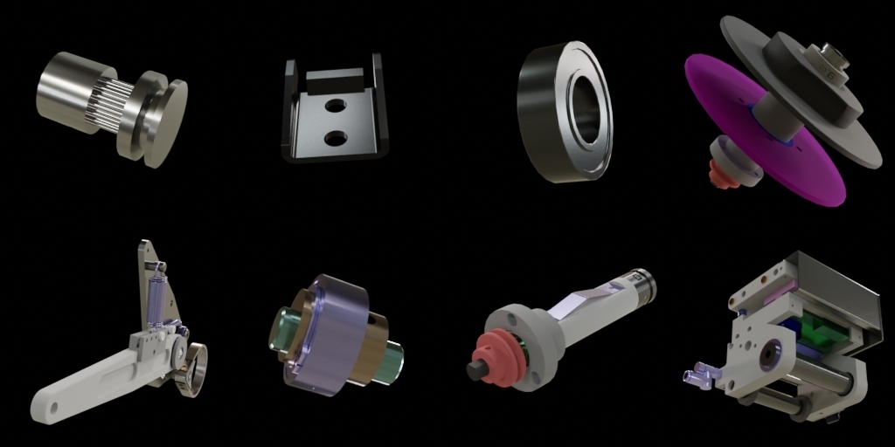

# SynthNet Rendering Pipeline

The purpose of the rendering pipeline is to parse a Blender file and export gltf-scenes for each of a machines' assemblys and single components to render multiple images for each part in order to create an image based search index from them.

## Getting Started

### Linux
1. Install [Blender](https://www.blender.org) and make sure you can run it from your Terminal
```bash
blender -v
```
2. Open terminal in project root directory
3. Create [Anaconda](https://www.anaconda.com/) environment from [environment.yml](./environment.yml)
 ```bash
conda env create --file environment.yml 
```
4. Run the pipeline mini example to test your environment</br>
This Process could take a few minutes depending on your system.
```bash
bash scripts/run_minimal_example.sh
``` 

## Usage

A full process, from preprocessing to rendered images involves three essential steps.
1. **Preprocessing** to create the render configuration JSON file (RCFG).
2. **GLTF Export** to export GLTF files that describes a scene for each machine part according to the RCFG.
3. **Rendering** to read each parts GLTF files and render multiple images from it.

### Run Complete Pipeline
The simplest method to run the whole pipeline is to use the bash script [run_minimal_example.sh](./scripts/run_minimal_example.sh). 
Simply navigate to the project root and run
```bash
bash scripts/run_minimal_example.sh
``` 
Feel free to use this script as starting point to setup your own experiments.

---
### Preprocessing
The [preprocessing](./preprocessing.py) script creates a render configuration according to a [json schema](./validation/schemas/rcfg_schema_v2.json). The created RCFG lists every machine part that must be rendered and defines all lights, cameras, materials and environment maps used. Further it defines render setups, that describe which of the scene components are used for each particular render.

Run the command below to see all options for the preprocessing script.
```bash
python preprocessing.py --help
```
---
### GLTF Export
The [GLTF Export](./bpy_modules/export_gltfs.py) reads the RCFG created by the preprocessing step and a structured .blend file of a machine. Then it uses the [Blender API](https://docs.blender.org/api/current/index.html) to create cameras and lights, assigns materials to single parts and loads environment maps according to the RCFG. Finally, a .GLB file is exported for every frame that should be rendered. (WIP: We want to export one GLB/part instead of one for each render)

See the example start script below
```bash
blender -b -P ./bpy_modules/export_gltfs.py -- --rcfg_file /path/to/rcfg_file.json --data_dir path/to/resources --out_dir path/to/out_dir
```
---
### Rendering
The [Rendering](./bpy_modules/render.py) process reads GLTF files exported by the *GLTF Export* and simply renders them.

See the example start script below
```bash
blender -b -P ./bpy_modules/render.py -- --in_dir /path/to/gltf_files --out_dir /path/to/output_dir --res_x 256 --res_y 256 --out_quality 100 --out_format JPEG --engine CYCLES
```

## Render Configuration (RCFG)

The render configuration (RCFG) is a JSON file that determines the scene components and render setups for each machine part. This includes cameras, lights, materials and environment maps. The RCFG file must follow the [Config Schema](./validation/schemas/rcfg_schema_v2.json).