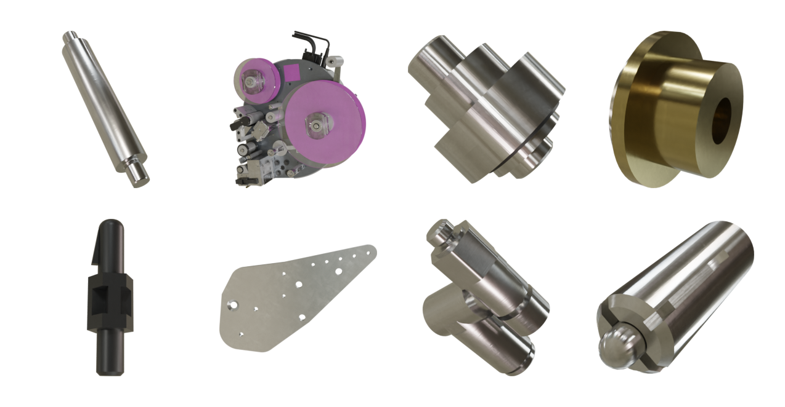

# SynthNet Rendering Pipeline

The purpose of the SynthNet Render Pipeline is to render RGB and depth images of .OBJ files or a structured .BLEND file generated from exported CAD data.
The pipeline allows you to configure various camera, light, environment map, and texture material generation and assignment options.
The process consists of three steps: Preprocessing, GLTF export, and rendering.

# Getting Started

## Linux
1. Install [Blender](https://www.blender.org) 3.1.0 or later and make sure you can run it from your Terminal
```bash
blender -v
```
2. Open terminal in project root directory
3. Create [pyenv](https://github.com/pyenv/pyenv) environment using `python 3.9.18`
 ```bash
pyenv install 3.9.18
pyenv virtualenv synthnet-render-pipeline
```
4. Activate the pyenv environment and install dependencies from from [requirements.txt](./requirements.txt)
 ```bash
pyenv shell synthnet-render-pipeline
pip install -r requirements.txt
```
5. Run the pipeline mini example to test your environment</br>
This Process could take a few minutes depending on your hardware.
```bash
bash scripts/run_minimal_example.sh
```
If everything worked, you should find 39 renderings, three of each part, in the `out/0-mini-example/renders` directory.

# Usage

A full process, from preprocessing to rendered images involves three essential steps.
1. **Preprocessing** to create the render configuration JSON file (RCFG).
2. **GLTF Export** to export GLTF files that describes a scene for each machine part according to the RCFG.
3. **Rendering** to read each parts GLTF files and render multiple images from it.

## Run Complete Pipeline
The simplest method to run the whole pipeline is to use the bash script [run_minimal_example.sh](./scripts/run_minimal_example.sh).
Simply navigate to the project root and run
```bash
bash scripts/run_minimal_example.sh
```
Feel free to use this script as starting point to setup your own experiments.

---
## Preprocessing
The [preprocessing](./preprocessing.py) script creates a render configuration according to a [json schema](./validation/schemas/rcfg_schema_topex.json). The created RCFG lists every machine part that must be rendered and defines all lights, cameras, materials and environment maps used. Further it defines render setups, that describe which of the scene components are used for each particular render.

Run the command below to see all options for the preprocessing script.
```bash
python preprocessing.py --help
```
---
## GLTF Export
The [GLTF Export](./bpy_modules/export_gltfs.py) reads the RCFG created by the preprocessing step and a structured .blend file of a machine. Then it uses the [Blender API](https://docs.blender.org/api/current/index.html) to create cameras and lights. Subsequently, a .GLB file is exported for every part and assembly of the machine that is defined in the RCFG.

See the example start script below
```bash
blender -b -P ./bpy_modules/export_gltfs.py -- --rcfg_file /path/to/rcfg.json --out_dir path/to/out_dir
```
---
## Rendering
The [Rendering](./bpy_modules/render.py) process reads GLTF files exported by the *GLTF Export* and renders them according to the render setups defined in the RCFG for each part. The render module also adds defined materials to each part and adds a specified environment map to the scene for each render.

See the example start script below
```bash
blender -b -P ./bpy_modules/render.py -- --gltf_dir /path/to/gltf_files --material_dir /path/to/material_files --envmap_dir /path/to/envmap_files --rcfg_file /path/to/rcfg_file.json --out_dir /path/to/output_dir --res_x 256 --res_y 256 --out_quality 100 --out_format PNG --engine CYCLES --device GPU
```

# Outputs

## Copy of input data
Data that has been used as inputs for the rendering pipeline.

## Render configuration (RCFG)
The render configuration (RCFG) is a JSON file that determines the scene components and render setups for each machine part. besides the rendered objects this includes cameras, lights. The RCFG file must follow the [Config Schema (Topex)](./validation/schemas/rcfg_schema_topex.json) or [Config Schema (OBJ)](./validation/schemas/rcfg_schema_obj.json).

## GLTF
.GLB files that are exported by the export_gltf.py script.

## Render
The rendered RGB and normalized depth images as well as unmodified OPEN_EXR depth data.

## Metadata
Processed metadata (csv/xlsx) from input data and added information that is added in pipeline processing steps.
